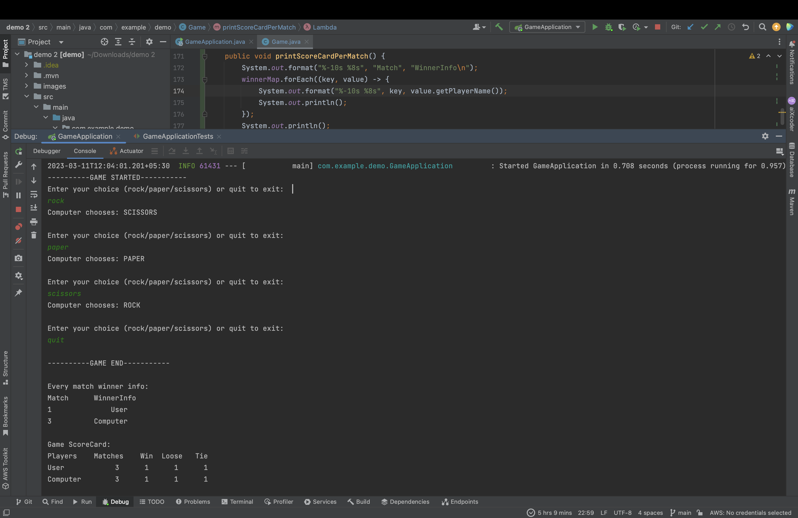

# Rock Paper Scissors Game Implementation: 

### Game Rule
1. If both players create the same formation then the game is a tie or draw.
2. The Rock beats the Scissors  (rock crushes scissors)
3. The Scissors beat the Paper (scissors cut paper)
4. The Paper beats the Rock (paper can cover the rock)

For more Info: [Wikipedia](https://en.wikipedia.org/wiki/Rock_paper_scissors)

### Dependencies to run this appplication:
- [java developement IDE](https://www.jetbrains.com/idea/)
- [download homebrew](https://brew.sh/)
- [install java 17](https://formulae.brew.sh/formula/openjdk@17)
- [use this to install mvn](https://formulae.brew.sh/formula/maven)

1. please download zip file from [gitHub](https://github.com/pkjkumar66/game)
2. build this project and run it

### Project contains
1. Implementation of Rock Paper Scissors Game
   - Player object with name and score
   - Result enum with possible outcomes: TIE, WIN, LOOSE
   - Status enum indicating game status: STARTED, NOT_STARTED, FINISHED
   - Symbol enum representing available moves: ROCK, PAPER, SCISSORS
   - Game object with player list, status, result, Symbol options, number of matches, and number of ties in one session
2. Added test cases for user 
   - when game will tie or user will win/loose 
   - when user chooses correct/incorrect choices among (rock/paper/scissors/quit).

### How to play
1. The game will be played between a user and a computer. The computer will choose its moves randomly.
2. User interaction will occur through a terminal prompt, which will display the following message:  
   " Enter your choice (rock/paper/scissors) or type 'quit' to exit: ". The user may then choose one of the available options.
3. The computer will then randomly choose one of the available options.
4. Steps 2 and 3 will be repeated until the user chooses to quit by typing 'quit'.
5. At the end of the game, the scorecard of all the matches played during the session will be printed.
6. 

